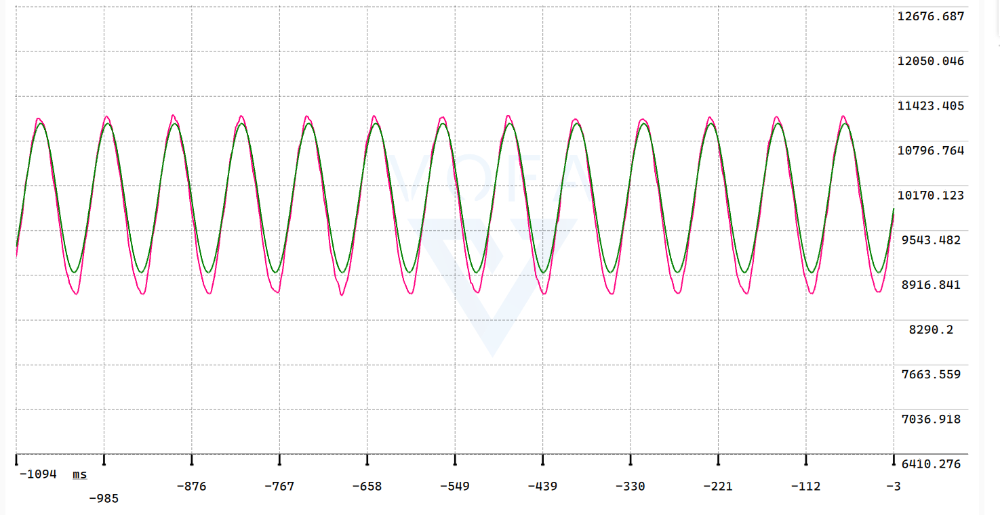
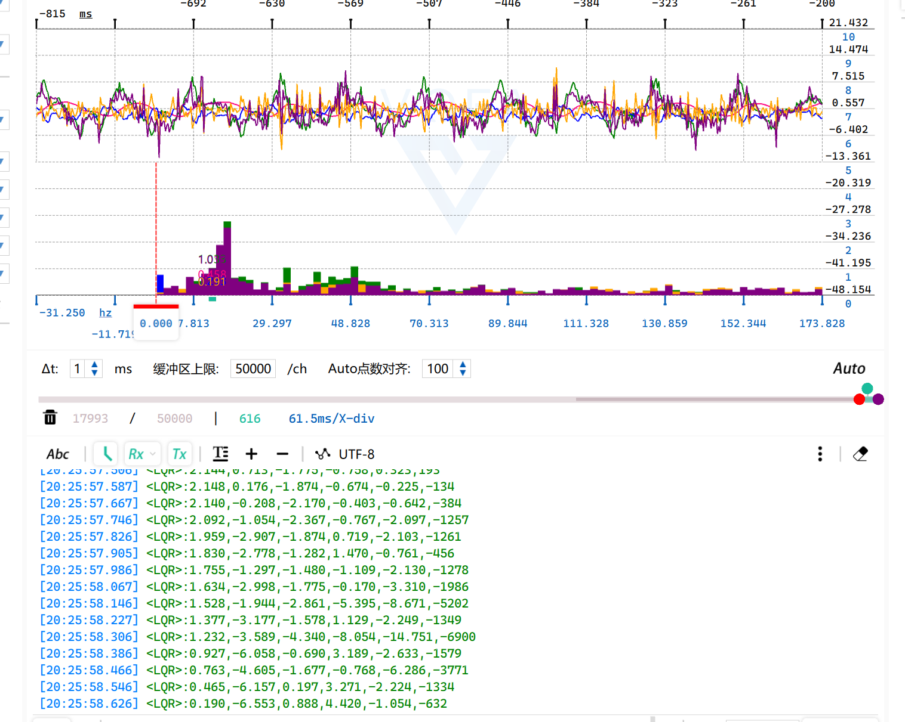
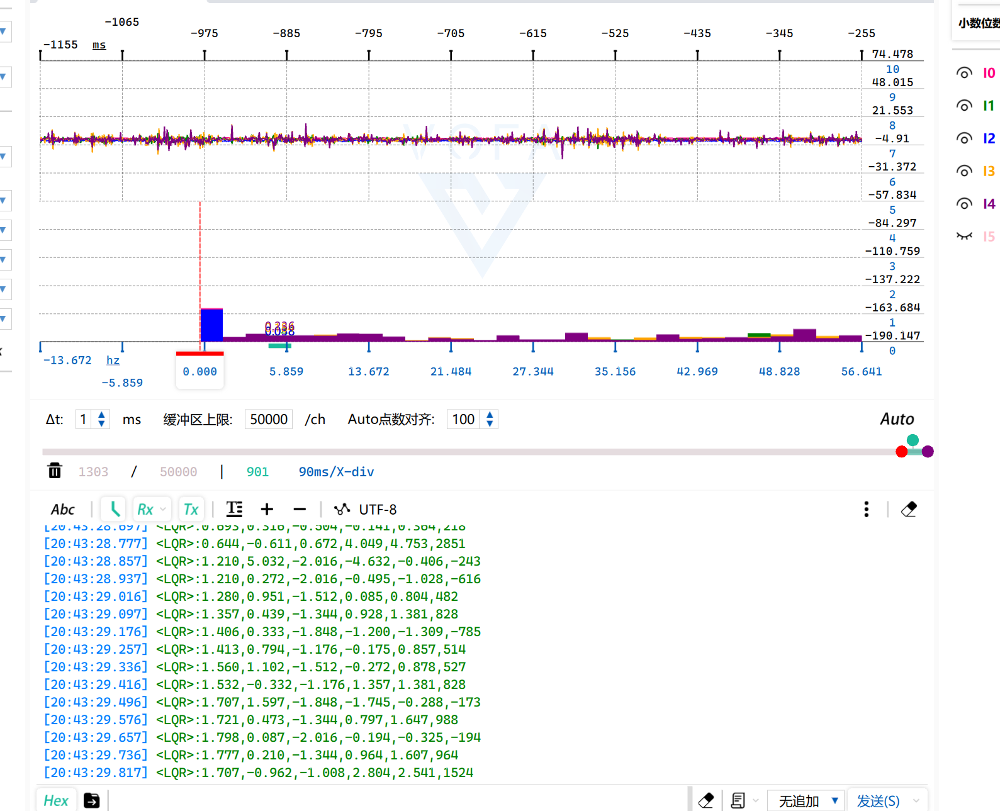
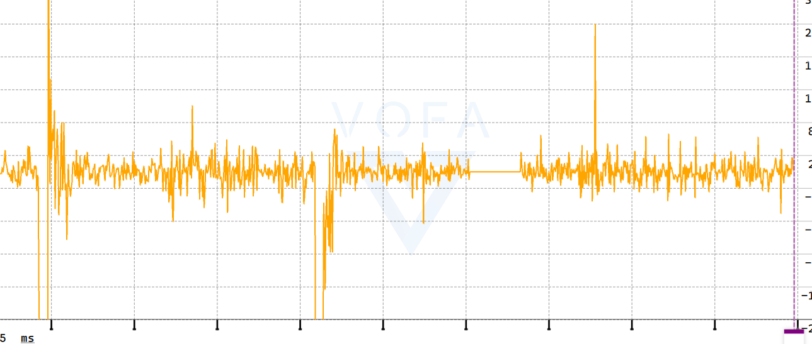

# 学习内容：
> LQR，动态规划的学习

# 实现：
>  倒立摆的PID稳定，然后就是PID沿着正弦（5阶Talyer展开）跟随。还有LQR的调参，平衡。

# 问题记录：

> - [ ] 在倒立摆平衡中，平衡车的控制环由角度环（Balance_Pwm）和位置环（Position_Pwm）两部分 PWM 叠加而成，单独测试时 Moto = Position_Pwm 能实现位置闭环、Moto = Balance_Pwm 能实现角度闭环，但叠加时原作者用的是 Moto = Balance_Pwm - Position_Pwm ，直觉上认为两个环应该像「并联」一样各管一个目标（一个稳角度、一个稳位置）直接相加即可，可实际测试发现用加号 + 系统只能在极短的时间保持稳定。

```c
/* --- 角度环 PD 控制：每个控制周期都执行 --- */
Balance_Pwm = Balance(Angle_Balance);

/* --- 位置环 PD 控制：每 5 次循环（约 25ms）执行一次 --- */
if (++Position_Target > 4)
{
    Position_Pwm    = Position(Encoder);
    Position_Target = 0;
}

/* --- 双环叠加，计算最终电机 PWM --- */
Moto = Balance_Pwm - Position_Pwm;
// Moto = Position_Pwm;   // 调试用：单独测试位置环

/* --- PWM 限幅，防止占空比 100% 带来的系统不稳定 --- */
Xianfu_Pwm();

/* --- 写入 PWM 寄存器 --- */
Set_Pwm(Moto);
```

> 可能是两个环相互影响，需要重新联调PID。

---
> - [ ] 对于LQR的倒立摆，现象是效果不如pid，就是如果对输入惩罚过大，那么位置就稳定不了，一直震荡，但是这个震荡比较平滑。对输入惩罚过小，则一直高频震荡。有什么好的解决办法吗。主要是R太小，就是会导致电机经常跑满限幅。


> **R=10，x=6000,angle=2000,主要频率分布在15HZ左右**    

> **R=1，x=6000,angle=2000,主要频率分布在2HZ以下**   

> **a=1.0与a=0.1的对比**

